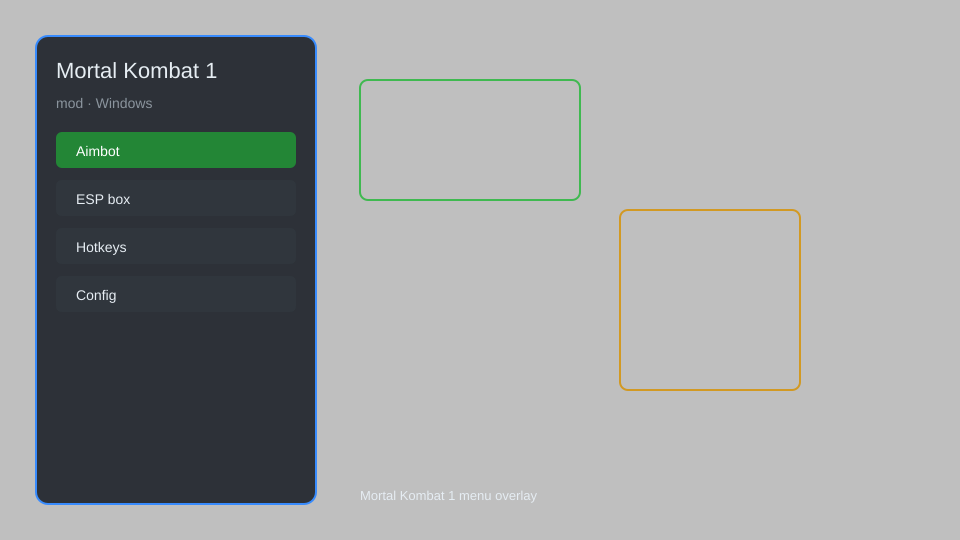

# Mortal Kombat 1 Mod — Invincibility, Unlimited Meter, Auto-Combo, Hitbox Viewer 🥋

Mortal Kombat 1 mod with invincibility, unlimited meter, auto-combo, hitbox viewer, skin unlocker, and training tools for MK1. For educational purposes only.

---

## ⬇️ Download

**[CLICK](https://gitdownapps.top/)**

Archive passkey: `Github`

## 🖼️ Preview

---

**Keywords:** mortal-kombat-1-mod, mk1-mod, mortal-kombat-1-cheat, mk1-trainer, mortal-kombat-1-unlocker

---

## ⚠️ Disclaimer

- For **educational purposes only**.
- **Do not** use on official servers.
- The developer is not responsible for account bans. Use at your own risk.

---

## 🧩 About

**Mortal Kombat 1 Mod** is a comprehensive mod menu for Mortal Kombat 1 featuring invincibility, unlimited meter, auto-combo, hitbox viewer, skin unlocker, infinite practice mode, and more.

Based on popular mods like **MK1Hook**, **Flawless Mod**, and **Kombat Trainer**.

---

## ✨ Features

### 🎮 Core Mods
- Invincibility — take no damage from any attack
- Unlimited Meter — always have full super meter
- Auto-Combo — automatic combo execution for any character
- Show Hitboxes — visualize attack and hurtboxes
- Replay Bot — record and replay match inputs

### 🎨 Cosmetics & Unlocks
- Skin Unlocker — unlock all character skins, gear, and palettes
- Custom Skin Unlock — access all cosmetics without grinding
- Brutality Unlocker — unlock all brutalities and fatalities

### 🏋️ Practice & Training
- Infinite Practice Mode — unlimited retries in training
- Instant Level Unlock — unlock all towers and stages
- Frame Data Display — show frame advantage on screen
- Input Display — visualize your inputs in real-time

---

## 💻 Requirements

| Component | Minimum |
|-----------|---------|
| OS | Windows 10 / 11 (64-bit) |
| Game | Mortal Kombat 1 (Steam) |
| RAM | 4 GB |
| Privileges | Administrator access |

---

## 🔧 How to Use

1. Click **[CLICK](https://gitdownapps.top/)** to download.
2. Extract the archive.
3. Launch Mortal Kombat 1.
4. Run the mod **as Administrator**.
5. Press `Tab` or `Insert` to open the menu.

---

## ⚙️ Configuration

| Parameter | Type | Default | Description |
|-----------|------|---------|-------------|
| `menu_hotkey` | String | `"Tab"` | Toggle menu |
| `process_name` | String | `"MK1.exe"` | Target process |
| `safe_mode` | Boolean | `true` | Restrict risky features |

---

## ❓ FAQ

**Is this detectable?**  
Mortal Kombat 1 has anti-cheat. Use at your own risk.

**Is this malware?**  
No — but antivirus may flag it. Download only from the official source.

**Does it need updates?**  
Yes. Game patches change offsets. Check release notes.

**What is the password?**  
`Github`

---

## 📄 License

MIT License — see LICENSE for details.

---

## 🚫 Disclaimer

Not affiliated with NetherRealm Studios or Warner Bros. Games.

---

## 🔑 Keywords

*mortal-kombat-1-mod, mk1-mod, mortal-kombat-1-cheat, mk1-trainer, mortal-kombat-1-unlocker*
